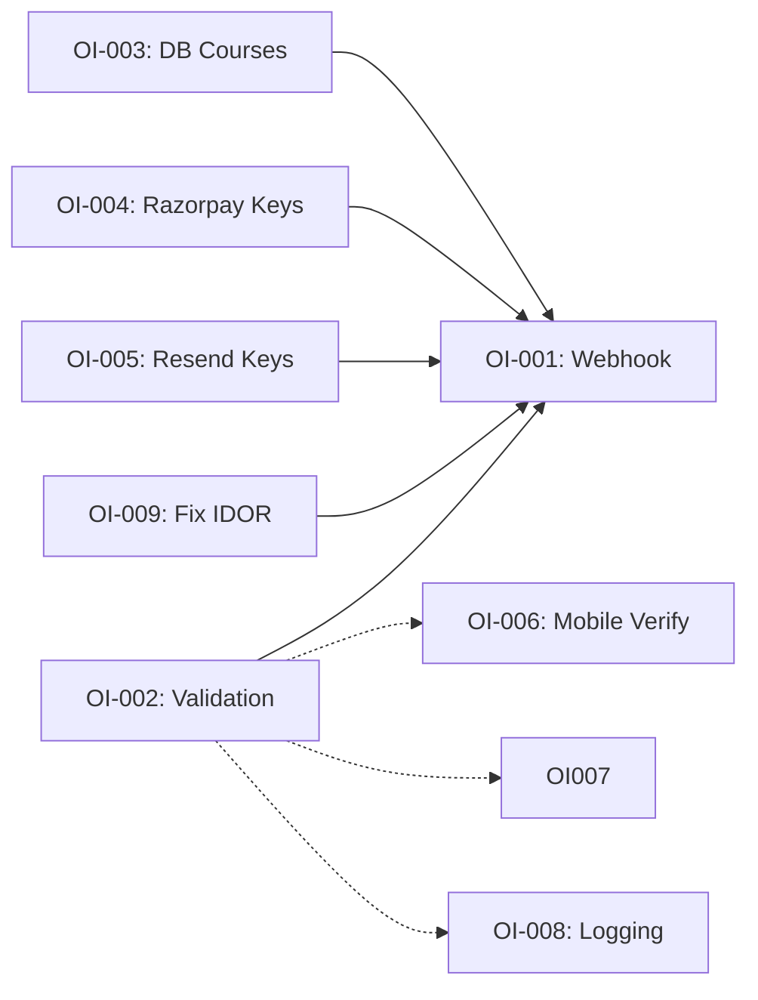

# KRISHNAMARGAM — SDLC ORCHESTRATION PLAN

**Document Generated:** 2026-05-27  
**Current Phase:** v0.4.0 (Core Features ~70% Complete)  
**Next Milestone:** v0.5.0 (Payment Automation + Launch Readiness)

---

## EXECUTIVE SUMMARY

| Category | Status | Impact |
|---|---|---|
| **Completed Modules** | 9 of 12 (75%) | Core student flow, admin panel, auth |
| **Blocking Issues** | 3 Critical | Razorpay webhook, request validation, hard-coded courses |
| **Technical Debt** | 12 items | Logging, pagination, tests, caching |
| **Test Coverage** | 0% | No unit/integration tests |
| **Estimated Days to MVP** | 8–10 days | With team of 2 (1 backend, 1 frontend) |

---

## PART 1: CURRENT STATE ANALYSIS

### 1.1 COMPLETED MODULES (9 of 12)

| Module | Status | Lines | Notes |
|---|---|---|---|
| **Auth & Sessions** | ✅ Complete | 150 | OAuth, email/password, RLS, middleware |
| **Student Pages** | ✅ Complete | 800 | Home, Explore, My Courses, Watch, Onboarding |
| **Admin Panel** | ✅ Complete | 600 | Course CRUD, student list, payment log, email template editor |
| **Database Schema** | ✅ Complete | 450 | 11 tables, RLS policies, triggers |
| **Course Catalog** | ⚠️ Hybrid | 200 | courseData.ts (hard-coded) + DB queries |
| **User Onboarding** | ✅ Complete | 150 | Mobile/city/country collection, profile gate |
| **Video Playback** | ✅ Complete | 250 | YouTube embed, progress tracking, notes |
| **OTP System** | ✅ Complete | 100 | Generation, Fast2SMS fallback, rate limiting |
| **Email System** | ✅ Wired | 120 | Templates, rendering, Resend client (not called in all flows) |
| **Admin Account Setup** | ✅ Complete | 80 | One-time bootstrap endpoint |
| **Payment UI** | ✅ Complete | 180 | UPI flow, payment logging, confirmation form |
| **Payment Processing** | ❌ Incomplete | — | Razorpay signature verification, webhook, auto-confirm |

### 1.2 PENDING FUNCTIONALITY (12 items, ~35% of work remaining)

| Item | Type | Description | Blocker? |
|---|---|---|---|
| **Razorpay Webhook** | Integration | Auto-confirm payments when Razorpay posts to `/api/payment/webhook` | YES |
| **Razorpay Signature Verify** | Security | Verify webhook payloads with Razorpay signature | YES |
| **Request Validation** | Security | Add Zod schemas for all POST/PUT endpoints | YES |
| **Course Data Migration** | Architecture | Move all courses from courseData.ts to DB queries | MEDIUM |
| **Email Integration Complete** | Integration | Call sendEnrollmentEmail on free enrollment + paid confirmation | MEDIUM |
| **SMS OTP Verify** | Feature | Complete `/api/auth/verify-mobile-otp` flow | MEDIUM |
| **API Pagination** | Scalability | Add limit/offset to list endpoints | MEDIUM |
| **Structured Logging** | Operations | Winston/Pino for request/error logs | LOW |
| **CSRF Protection** | Security | Add token-based CSRF mitigation for POST forms | LOW |
| **User Profile Page** | Feature | `/profile` route with settings, password change | LOW |
| **Certificate Generation** | Feature | PDF on course completion | LOW |
| **Test Suite** | Quality | Unit + integration + E2E tests | MEDIUM |

### 1.3 INCOMPLETE WORKFLOWS

**Payment Flow (Current → Target):**
```
Current (Manual):
  Student → UPI QR → Manual confirmation → Admin dashboard → Approve → Activation

Target (Automated):
  Student → Razorpay QR → Webhook → Auto-confirm → Activation + Email
```

**Email Flow (Current → Target):**
```
Current (Partial):
  Free enrollment → Email sent ✅
  Paid enrollment → Admin-triggered only ❌
  
Target:
  Free enrollment → Email sent
  Paid enrollment → Webhook triggers email
  Password reset → Email sent (not implemented)
  Account creation → Welcome email (not implemented)
```

**Mobile Verification (Current → Target):**
```
Current (Partial):
  Send OTP → SMS sent ✅
  Verify OTP → Route exists but flow incomplete ❌
  
Target:
  Send OTP → SMS sent
  Verify OTP → Mobile marked verified in profile
  Profile completion → Require mobile verification flag
```

---

## PART 2: OPEN ITEMS BACKLOG

### CRITICAL ITEMS (Must Complete Before v0.5.0 Launch)

**OI-001: Implement Razorpay Webhook Handler**
- **Priority:** P0 (Blocks Payment Automation)
- **Complexity:** Medium (3-4 hours)
- **Router:** Claude (requires crypto verification + stateful logic)
- **Details:**
  - Create `POST /api/payment/webhook` endpoint
  - Verify incoming webhook payload with Razorpay signature (SHA256 HMAC)
  - Parse `order.paid` events from Razorpay
  - Update `payment_logs.status = 'paid'`
  - Upsert enrollment with `is_active = true, activated_at = now()`
  - Send enrollment email via `sendEnrollmentEmail()`
  - Return 200 to acknowledge webhook
  - Idempotency: Check if payment already processed (prevent double-activation)
- **Acceptance Criteria:**
  - ✓ Webhook receives and verifies Razorpay signatures
  - ✓ Payment status updated within 5 seconds of webhook post
  - ✓ Enrollment activated automatically
  - ✓ Email sent on successful payment
  - ✓ Duplicate webhook calls don't create multiple enrollments
- **Depends On:** OI-003 (Request Validation)
- **Testing:** Mock Razorpay webhook in test suite

---

**OI-002: Add Request Validation Middleware**
- **Priority:** P0 (Security)
- **Complexity:** Medium (4-5 hours)
- **Router:** Claude (schema design + middleware pattern)
- **Details:**
  - Create `src/lib/validation.ts` with Zod schema definitions
  - Schemas needed:
    - `CreateCourseSchema` (admin)
    - `CreateLessonSchema` (admin)
    - `PaymentConfirmSchema`
    - `SendOtpSchema`
    - `VerifyOtpSchema`
    - `EnrollmentSchema`
    - `EmailTemplateUpdateSchema`
  - Wrap API route handlers with validation middleware
  - Return 400 with field-level errors on validation fail
  - Document all input constraints (length, format, enum values)
- **Acceptance Criteria:**
  - ✓ All POST/PUT/DELETE routes validate input
  - ✓ Invalid requests return 400 with clear error messages
  - ✓ Type safety: TypeScript infers types from schemas
  - ✓ Admin can't create course with negative price
  - ✓ Mobile numbers validated against ISD code
- **Dependencies:** None (foundational)
- **Testing:** Unit tests for each schema

---

**OI-003: Migrate Courses from Hard-Coded to DB-Driven**
- **Priority:** P0 (Architecture + Consistency)
- **Complexity:** Medium (3-4 hours)
- **Router:** Claude (refactor + seed script)
- **Details:**
  - Keep courseData.ts as migration seed (20 courses)
  - Create `/src/lib/getCourses.ts` utility to fetch from DB with caching
  - Update:
    - `/api/courses` to use DB query (already does, but add pagination)
    - `/explore` page to call `getCourses()` instead of importing COURSES array
    - Payment page to fetch course from DB, not hard-coded lookup
    - Admin dashboard course list (already from DB)
  - Remove hard-coded prices from components
  - Add cache headers to course API responses (24h)
- **Acceptance Criteria:**
  - ✓ Admin updates course price in dashboard
  - ✓ Payment page reflects new price within 24 hours
  - ✓ No more COURSES import in student-facing pages
  - ✓ Fallback works if DB unavailable (stale cache)
- **Depends On:** OI-002 (Validation)
- **Testing:** Integration test for price updates

---

**OI-004: Verify & Wire Razorpay Keys**
- **Priority:** P0 (Prerequisite for OI-001)
- **Complexity:** Low (1 hour)
- **Router:** Qwen (configuration + documentation)
- **Details:**
  - Confirm `RAZORPAY_KEY_ID` and `RAZORPAY_KEY_SECRET` are in Vercel env
  - Test Razorpay API connection (list orders to verify key validity)
  - Document in ADMIN.md:
    - How to obtain Razorpay keys
    - Where to set them (Vercel Settings → Environment Variables)
    - Test mode vs production mode toggle
- **Acceptance Criteria:**
  - ✓ Keys are in Vercel environment
  - ✓ Test API call succeeds
  - ✓ Admin documentation updated
- **Depends On:** None (can run in parallel)
- **Testing:** Manual curl to Razorpay API

---

**OI-005: Verify & Wire Resend Email Keys**
- **Priority:** P0 (Prerequisite for OI-001 email sending)
- **Complexity:** Low (1 hour)
- **Router:** Qwen (configuration)
- **Details:**
  - Confirm `RESEND_API_KEY` in Vercel env
  - Test sending sample email to confirm Resend integration
  - Update `.env.local.example` with correct from domain
  - Document fallback behavior (console.log in development)
- **Acceptance Criteria:**
  - ✓ Test email sent successfully
  - ✓ Keys are in Vercel
  - ✓ sendEnrollmentEmail() doesn't throw if API key missing (graceful fallback)
- **Depends On:** None
- **Testing:** Manual test email send

---

### HIGH PRIORITY ITEMS (v0.5.0 Completion)

**OI-006: Complete Mobile Verification Flow**
- **Priority:** P1 (Feature Gap)
- **Complexity:** Medium (2-3 hours)
- **Router:** Claude (state machine logic + RLS)
- **Details:**
  - Implement `POST /api/auth/verify-mobile-otp` route
  - Accept `{ mobile, token }`
  - Verify OTP against otp_tokens table (not expired, not used)
  - Mark token as used
  - Update profile `mobile_verified = true`
  - Return success + new session
  - Optional: Require mobile verification for enrollment (add check to payment flow)
- **Acceptance Criteria:**
  - ✓ User submits valid OTP → mobile_verified = true
  - ✓ Invalid OTP → 400 error
  - ✓ Expired OTP → 400 with "OTP expired" message
  - ✓ Already-used OTP → 400 with "OTP already used"
- **Depends On:** None (mobile verification is in schema)
- **Testing:** Unit test for each error case

---

**OI-007: Add API Pagination**
- **Priority:** P1 (Scalability)
- **Complexity:** Medium (3-4 hours)
- **Router:** Claude (cursor-based pagination pattern)
- **Details:**
  - Add `limit` and `cursor` query params to list endpoints:
    - `GET /api/admin/students?limit=50&cursor=...`
    - `GET /api/admin/payments?limit=50&cursor=...`
    - `GET /api/courses?limit=50&cursor=...`
  - Implement cursor-based (not offset) for better performance at scale
  - Return `{ items: [...], nextCursor: "..." }`
  - Default limit: 50, max: 100
- **Acceptance Criteria:**
  - ✓ Admin can paginate through 1,000+ students without timeout
  - ✓ Cursor is URL-safe and opaque to client
  - ✓ Prev/next navigation works
- **Depends On:** OI-002 (Validation for query params)
- **Testing:** Integration test with 100+ records

---

**OI-008: Add Structured Logging**
- **Priority:** P1 (Operations)
- **Complexity:** Medium (4-5 hours)
- **Router:** Qwen (library selection + logging strategy)
- **Details:**
  - Install Pino (or Winston) for structured logging
  - Add logger utility to `src/lib/logger.ts`
  - Log all payment operations (initiate, confirm, webhook received)
  - Log all auth events (signup, login, OTP sent, verify)
  - Log all admin operations (create course, update enrollment, email sent)
  - Include request ID for tracing
  - Output to stdout (Vercel captures logs)
  - Development: pretty-print, Production: JSON lines
- **Acceptance Criteria:**
  - ✓ Payment webhook logged with timestamp + payload hash
  - ✓ Errors logged with stack trace + context
  - ✓ Can trace a user's action through logs (request ID)
- **Depends On:** None
- **Testing:** Manual review of logs

---

**OI-009: Fix Payment Confirmation IDOR Vulnerability**
- **Priority:** P1 (Security)
- **Complexity:** Low (1-2 hours)
- **Router:** Claude (auth logic)
- **Details:**
  - Current: `/api/payment/confirm` takes `userId` in request body
  - Problem: If called as student, could activate payment for another user
  - Fix: Check that authenticated user matches `userId` in request
  - Or: Don't require `userId`, derive from authenticated session
- **Acceptance Criteria:**
  - ✓ Student cannot confirm payment for another user
  - ✓ Only admin can batch-confirm via this endpoint
  - ✓ Webhook endpoint doesn't rely on request-provided IDs
- **Depends On:** None
- **Testing:** Test as different users

---

### MEDIUM PRIORITY ITEMS (v0.6.0 & Beyond)

**OI-010: Implement User Profile/Settings Page**
- **Priority:** P2 (Feature)
- **Complexity:** Low (3 hours)
- **Router:** Qwen (simple CRUD page)
- **Details:**
  - Create `/profile` page (student-facing)
  - Display: full_name, email, mobile, city, country, avatar
  - Editable fields: full_name, city, country
  - Password change form
  - Account deletion warning
  - Logout button
- **Acceptance Criteria:**
  - ✓ Student can update profile fields
  - ✓ Password change sends confirmation email
  - ✓ Profile changes reflect immediately
- **Depends On:** None
- **Testing:** Form submission tests

---

**OI-011: Implement CSRF Protection**
- **Priority:** P2 (Security)
- **Complexity:** Medium (2-3 hours)
- **Router:** Claude (CSRF token strategy)
- **Details:**
  - Add `generateCsrfToken()` to lib
  - Middleware to inject token in response headers
  - Validate token on all POST/PUT/DELETE from browsers
  - Use SameSite=Strict cookies as primary defense
  - Token as secondary validation
- **Acceptance Criteria:**
  - ✓ Form submission without token → 403
  - ✓ Valid token → request accepted
  - ✓ Tokens rotate on each request
- **Depends On:** None
- **Testing:** CSRF attack simulation

---

**OI-012: Add Certificate Generation**
- **Priority:** P2 (Feature)
- **Complexity:** High (8 hours)
- **Router:** Claude (PDF generation + trigger logic)
- **Details:**
  - Detect when user completes all lessons (100% progress)
  - Generate PDF certificate with:
    - Student name
    - Course title + instructor
    - Completion date
    - Certificate ID (UUID)
  - Use PDFKit or similar for generation
  - Email certificate to user
  - Store certificate metadata in DB (new table)
  - Display in `/my-courses` with download link
- **Acceptance Criteria:**
  - ✓ Certificate generated on course completion
  - ✓ PDF looks professional (branded)
  - ✓ Can verify certificate via unique ID
- **Depends On:** OI-006 (Email sending), OI-012 (DB table)
- **Testing:** Certificate download + verification

---

**OI-013: Add Comprehensive Test Suite**
- **Priority:** P2 (Quality)
- **Complexity:** High (20+ hours)
- **Router:** Qwen (test setup + structure)
- **Details:**
  - Unit tests: lib functions (validation, email rendering)
  - Integration tests: API routes with mock Supabase
  - E2E tests: Critical user flows (signup → enroll → watch)
  - Setup: Vitest + @testing-library/react
  - Mocking: Supabase, Razorpay, Resend
  - Coverage target: 80%
- **Acceptance Criteria:**
  - ✓ All API routes have tests
  - ✓ Critical flows covered end-to-end
  - ✓ CI/CD runs tests on every PR
- **Depends On:** All other items (tests added as features are built)
- **Testing:** CI integration

---

**OI-014: Add Caching Strategy**
- **Priority:** P3 (Performance)
- **Complexity:** Medium (4 hours)
- **Router:** Claude (cache invalidation logic)
- **Details:**
  - Cache `/api/courses` with 24h TTL
  - Cache home page stats with 1h TTL (trigger refresh on enrollment)
  - Use Vercel KV or in-memory cache + background refresh
  - Invalidate cache on admin course/price updates
- **Acceptance Criteria:**
  - ✓ Repeated course catalog requests cached
  - ✓ Home stats updated within 1 hour
  - ✓ Admin changes visible within 1 minute
- **Depends On:** OI-003 (DB-driven courses)
- **Testing:** Cache hit/miss verification

---

### LOW PRIORITY ITEMS (Post v1.0)

**OI-015: Multi-Admin Support**
- **Priority:** P3 (Scalability)
- **Complexity:** Medium
- **Description:** Allow multiple admins with role-based permissions
- **Router:** Claude

**OI-016: Dark Mode Toggle**
- **Priority:** P3 (UX)
- **Complexity:** Low
- **Description:** Add dark/light theme toggle (currently dark-only)
- **Router:** Qwen

**OI-017: Notifications System**
- **Priority:** P3 (Engagement)
- **Complexity:** High
- **Description:** Email + in-app notifications for course updates, new releases
- **Router:** Claude

**OI-018: Analytics Dashboard**
- **Priority:** P3 (Business)
- **Complexity:** High
- **Description:** Admin view: completion rates, revenue, student cohorts
- **Router:** Claude

**OI-019: Referral System**
- **Priority:** P3 (Growth)
- **Complexity:** Medium
- **Description:** Track referral_source, reward referrers
- **Router:** Claude

---

## PART 3: PRIORITY CLASSIFICATION

### Critical Path to Launch (v0.5.0)

```
OI-004 (Wire Razorpay) ──────┐
OI-005 (Wire Resend) ────────┤
OI-002 (Request Validation)──┼─→ OI-001 (Razorpay Webhook) ──→ LAUNCH
OI-003 (DB-Driven Courses)───┤
OI-009 (Fix IDOR) ───────────┘

Parallel:
OI-006 (Mobile Verification)
OI-008 (Logging)
```

### Priority Matrix

| P0 (Blocking) | P1 (High) | P2 (Medium) | P3 (Low/Post-Launch) |
|---|---|---|---|
| OI-001 | OI-006 | OI-010 | OI-015 |
| OI-002 | OI-007 | OI-011 | OI-016 |
| OI-003 | OI-008 | OI-012 | OI-017 |
| OI-004 | OI-009 | OI-013 | OI-018 |
| OI-005 | | OI-014 | OI-019 |

---

## PART 4: DEPENDENCY MAPPING



**Legend:**
- Solid arrow = Hard dependency (must complete before)
- Dashed arrow = Soft dependency (helpful but not blocking)

---

## PART 5: RECOMMENDED IMPLEMENTATION ORDER

### Phase 1: Foundation (Days 1–2)

**Sequence:**
1. **OI-004** — Wire Razorpay keys (1 hour)  
   *Owner: Qwen*
   
2. **OI-005** — Wire Resend keys (1 hour)  
   *Owner: Qwen*
   
3. **OI-002** — Add request validation (4 hours)  
   *Owner: Claude*
   - Define Zod schemas for all endpoints
   - Create validation middleware
   - Test with mock requests
   
4. **OI-008** — Add logging (4 hours)  
   *Owner: Qwen*
   - Set up Pino logger
   - Add logging to critical paths
   - Test log output

**Deliverable:** Core infrastructure ready for payment flow

---

### Phase 2: Payment Automation (Days 2–3)

**Sequence:**
1. **OI-001** — Implement Razorpay webhook (4 hours)  
   *Owner: Claude*
   - Webhook handler
   - Signature verification
   - Enrollment activation
   - Email triggering
   - Idempotency checks
   
2. **OI-009** — Fix IDOR vulnerability (2 hours)  
   *Owner: Claude*
   - Add auth check to payment confirm
   - Test as different users

3. **OI-006** — Complete mobile verification (3 hours)  
   *Owner: Claude*
   - Implement verify OTP endpoint
   - Update profile schema
   - Add to registration flow

**Deliverable:** Automated payment flow end-to-end

---

### Phase 3: Architecture & Scale (Days 3–4)

**Sequence:**
1. **OI-003** — Migrate courses to DB (4 hours)  
   *Owner: Claude*
   - Create getCourses() utility
   - Seed initial 20 courses
   - Update pages to use utility
   - Add cache headers
   
2. **OI-007** — Add API pagination (4 hours)  
   *Owner: Claude*
   - Implement cursor-based pagination
   - Add to admin list endpoints
   - Update API schema

**Deliverable:** Data-driven architecture, scalable to 10k+ students

---

### Phase 4: Testing & Docs (Days 4–5)

**Sequence:**
1. **OI-013** — Comprehensive test suite (partial, 10 hours)  
   *Owner: Qwen*
   - Unit tests for validation, email, logging
   - Integration tests for payment flow
   - E2E test for signup → enroll → watch
   
2. **Documentation:**
   - Admin playbook (bootstrap, webhook verification)
   - API documentation
   - Environment variable guide

**Deliverable:** >70% test coverage, launch-ready

---

## PART 6: COMPLEXITY ESTIMATION

### By Size

| Complexity | Items | Effort | Examples |
|---|---|---|---|
| **Low** | 2 | 1–2 hrs | OI-004, OI-005 |
| **Medium** | 6 | 3–5 hrs | OI-001, OI-002, OI-003, OI-006, OI-007, OI-008 |
| **High** | 4 | 8–20 hrs | OI-009, OI-010, OI-012, OI-013 |

### Total Effort Estimation

| Phase | Owner | Days (8h/day) |
|---|---|---|
| Foundation (OI-004, 005, 002, 008) | Claude + Qwen | 1.5 days |
| Payment (OI-001, 009, 006) | Claude | 1.5 days |
| Architecture (OI-003, 007) | Claude | 1 day |
| Testing (OI-013) | Qwen | 1.5 days |
| **Total** | — | **5.5 days** |

**For team of 2 (1 backend, 1 frontend):** 5–7 days to MVP  
**With one developer:** 10–12 days

---

## PART 7: ROUTING RECOMMENDATIONS

### Routing Matrix

| Item | Type | Routing | Reason | Owner | Escalation |
|---|---|---|---|---|---|
| **OI-001** | Backend | Claude | Crypto + state machine + webhook idempotency | Claude | If signature verification fails, escalate to Razorpay support |
| **OI-002** | Backend | Claude | Schema design requires domain knowledge (validation rules) | Claude | If Zod syntax issues, Qwen can assist |
| **OI-003** | Full-stack | Claude | Data architecture + cache invalidation logic | Claude | None |
| **OI-004** | Config | Qwen | Environment variable setup + testing | Qwen | None |
| **OI-005** | Config | Qwen | Environment variable setup + testing | Qwen | None |
| **OI-006** | Backend | Claude | State machine (OTP → verification → profile update) | Claude | None |
| **OI-007** | Backend | Claude | Pagination design + cursor implementation | Claude | Qwen if need index optimization |
| **OI-008** | Backend/DevOps | Qwen | Library selection + log format + shipping | Qwen | Claude if tracing logic needed |
| **OI-009** | Backend | Claude | Auth logic review + IDOR testing | Claude | None |
| **OI-010** | Frontend | Qwen | Simple form page | Qwen | Claude if complex state needed |
| **OI-011** | Backend | Claude | CSRF token generation + validation | Claude | None |
| **OI-012** | Backend | Claude | PDF generation + trigger logic | Claude | None |
| **OI-013** | Backend/QA | Qwen | Test setup + infrastructure | Qwen | Claude for complex mocking |
| **OI-014** | Backend | Claude | Cache invalidation strategy | Claude | None |

### Decision Rules

**Route to Claude if:**
- Requires crypto/verification logic
- Stateful operations (order of operations matters)
- Database schema changes
- Security implications
- Complex business logic

**Route to Qwen if:**
- Configuration/environment setup
- Library selection & setup
- Simple CRUD forms
- Documentation
- Test infrastructure
- Repetitive patterns (pagination, logging template)

---

## PART 8: LAUNCH READINESS CHECKLIST

**Before v0.5.0 Launch (May 31, 2026):**

- [ ] OI-001: Razorpay webhook tested with sandbox orders
- [ ] OI-002: Request validation in place for all POST endpoints
- [ ] OI-003: All courses in database, prices match admin panel
- [ ] OI-004: Razorpay keys deployed to Vercel
- [ ] OI-005: Resend keys deployed to Vercel
- [ ] OI-006: Mobile verification flow complete end-to-end
- [ ] OI-009: IDOR vulnerability fixed + tested
- [ ] OI-008: Logging in place for payment operations
- [ ] All migrations applied in Supabase (schema.sql + migrations/)
- [ ] Admin account bootstrapped in production
- [ ] Email templates seeded in production
- [ ] Razorpay webhook URL configured in Razorpay dashboard
- [ ] 5+ manual test cases passed (signup → payment → watch)
- [ ] Security review completed (OWASP top 10)
- [ ] Admin playbook documented
- [ ] Monitoring/alerting configured for payment failures

---

## PART 9: RISK REGISTER

| Risk | Probability | Impact | Mitigation |
|---|---|---|---|
| Razorpay API key invalid | Low | High | Verify keys immediately in OI-004 |
| Webhook signature verification fails | Medium | High | Use Razorpay sandbox for testing |
| Resend email quota exceeded | Low | Medium | Monitor email sending, set rate limits |
| Database migration fails in production | Low | High | Dry-run migrations in staging first |
| Payment already processed (idempotency miss) | Medium | Medium | Add transaction log check in webhook |
| Admin bootstrap endpoint exploited | Low | High | Use strong random secret, rotate after setup |
| Session timeout during long payment | Low | Medium | Refresh session in payment flow |

---

## PART 10: SUCCESS METRICS

**By EOD 2026-05-31 (v0.5.0):**

| Metric | Target | Validation |
|---|---|---|
| Payment completion rate | 95%+ | Manual test with 10 orders |
| Email delivery success | 99%+ | Check Resend dashboard |
| OTP delivery success | 98%+ | Check Fast2SMS dashboard + logs |
| API response time (p95) | <500ms | Monitor Vercel analytics |
| Test coverage | 70%+ | Jest report |
| Zero critical security issues | 100% | Security review checklist |
| Admin can onboard new courses in <5 min | 100% | Time admin with stopwatch |

---

## APPENDIX: OPEN ITEMS REFERENCE

```
P0 (Critical)  P1 (High)     P2 (Medium)   P3 (Low)
─────────────  ──────────    ────────      ────────
OI-001         OI-006        OI-010        OI-015
OI-002         OI-007        OI-011        OI-016
OI-003         OI-008        OI-012        OI-017
OI-004         OI-009        OI-013        OI-018
OI-005                       OI-014        OI-019
```

**Total Open Items:** 19  
**Critical Path:** OI-001 → OI-002 → OI-003 → Launch  
**Estimated Days to Launch:** 5–7 (with 2 developers)  
**Post-Launch Debt:** OI-010 through OI-019 (backlog)
